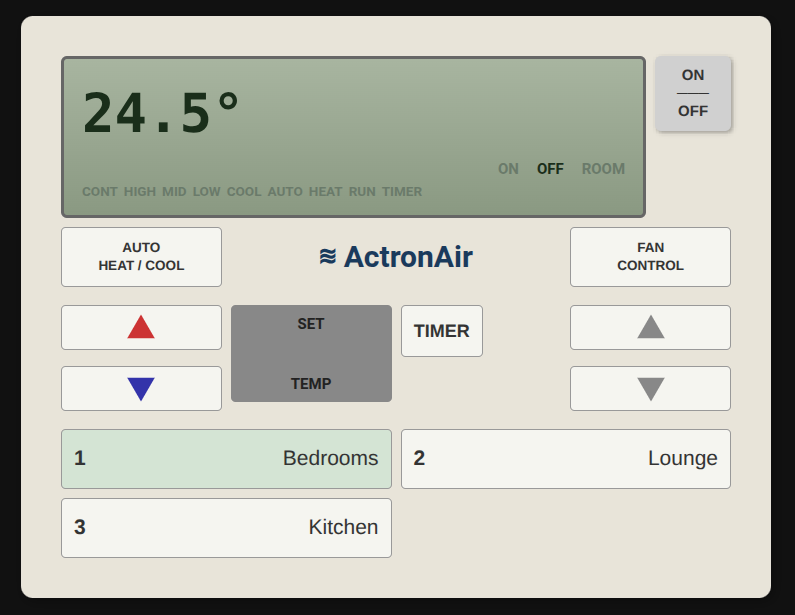

# Actron Air ESPHome Integration for Home Assistant

An ESPHome external component for reading and decoding pulse trains from the
Actron Air ESP32 keypad display, plus a Home Assistant integration with climate
entity and custom Lovelace card.

## Key Features

- **Interrupt-driven reading**: Accurate pulse train capture
- **40-bit decoding**: Full status from keypad display
- **Temperature display**: 7-segment decoder for setpoint
- **18 binary sensors**: Mode, fan, zones, timers
- **Error tracking**: Bit count for monitoring reliability
- **Type-safe config**: ESPHome validation for all settings
- **Climate entity**: Full HVAC control with zone presets
- **Custom Lovelace card**: Retro keypad-style control interface

## Hardware Requirements

- ESP32 (ESP-IDF framework)
- GPIO pin for pulse train input
- Connection to air conditioner keypad display output
- MCP4725 or MCP4726 DAC (I2C) for keypad button emulation
- BC548 NPN transistor
- Resistors: 20kΩ, 4.7kΩ, 1.2kΩ (0.5W or higher)

See the [forum thread](https://community.home-assistant.io/t/actron-aircon-esp32-controller-help/609062)
for detailed build instructions and wiring diagrams.

## Compatible Systems

This integration works with Actron Air ducted systems that use the older-style
wall controllers with a 4-wire interface (SENS, KEY, COMM, POWER).

### Wall Controllers

| Controller | Status | Notes |
|------------|--------|-------|
| LM24 | Confirmed | Multi-zone controller |
| LM7 / LM7-2W / LM7-2G | Community reported | 7-day programmable, up to 8 zones |
| LM7-D | Community reported | Ultima Zone Control Master |
| AM7 | Community reported | Original older controller |

### Air Conditioner Systems

**Compatible:**

- SRA series (e.g., SRA22C, SRA25C) - older multi-zone ducted systems
- SRD series (e.g., SRD175C, SRD22C) - older ducted systems
- ESP Plus, ESP Platinum, ESP Ultima with LM7/LM24 controllers
- Classic series (SRG models) with LM7/LM24 controllers

**Not compatible:**

- Systems with QUE controllers (different architecture)
- Systems with ActronConnect/ACM WiFi modules (post-2013)
- Serene Series with Easy Connect app

## Installation

This project has two parts:

1. **ESPHome component** - Runs on your ESP32 to read the keypad and control the AC
2. **Home Assistant integration** - Provides climate entity and Lovelace card

**Set up the ESPHome device first**, then install the Home Assistant integration.

### Step 1: ESPHome Device Setup

See [ESPHome Configuration](#esphome-configuration) below for detailed setup instructions.
The quickest way is to use the ESPHome package - just copy
[example_actron_air_keypad.yaml](example_actron_air_keypad.yaml) and customise for your setup.

### Step 2: Home Assistant Integration

Once your ESPHome device is running, install the integration:

#### HACS (Recommended)

[](https://my.home-assistant.io/redirect/hacs_repository/?owner=johnf&repository=actron-air-esphome&category=integration)

Or manually:

1. Open HACS in Home Assistant
2. Go to "Integrations" section
3. Click the three dots menu and select "Custom repositories"
4. Add `https://github.com/johnf/actron-air-esphome` with category "Integration"
5. Install "Actron Air ESPHome"
6. Restart Home Assistant
7. Go to Settings > Devices & Services > Add Integration
8. Search for "Actron Air ESPHome" and configure

The integration will automatically register the Lovelace card.

#### Manual Installation

1. Copy the `custom_components/actron_air_esphome` folder to your Home Assistant `config/custom_components/` directory
2. Restart Home Assistant
3. Go to Settings > Devices & Services > Add Integration
4. Search for "Actron Air ESPHome" and configure

## Lovelace Card Usage



Add the card to your dashboard:

```yaml
type: custom:actron-air-esphome-card
entity_prefix: actron_air
```

### Card Configuration Options

| Option | Type | Default | Description |
|--------|------|---------|-------------|
| `entity_prefix` | string | **required** | Prefix for ESPHome entities (e.g., `actron_air`) |
| `name` | string | - | Card title (optional) |
| `show_timer` | boolean | `true` | Show timer controls |
| `show_zones` | boolean | `true` | Show zone buttons |
| `zone_count` | number | `4` | Number of zones to display (1-7) |
| `zones` | array | - | Custom zone names |

### Full Configuration Example

```yaml
type: custom:actron-air-esphome-card
entity_prefix: actron_air
name: Air Conditioning
show_timer: true
show_zones: true
zone_count: 4
zones:
  - name: Bedrooms
  - name: Living Room
  - name: Kitchen
  - name: Office
```

### Expected Entity Names

The card expects entities with the following naming pattern based on your `entity_prefix`:

**Sensors:**

- `sensor.{prefix}_setpoint_temperature`

**Switches:**

- `switch.{prefix}_power`
- `switch.{prefix}_zone_1` through `switch.{prefix}_zone_8`

**Binary Sensors:**

- `binary_sensor.{prefix}_cool`
- `binary_sensor.{prefix}_heat`
- `binary_sensor.{prefix}_auto`
- `binary_sensor.{prefix}_run`
- `binary_sensor.{prefix}_fan_low`
- `binary_sensor.{prefix}_fan_mid`
- `binary_sensor.{prefix}_fan_high`
- `binary_sensor.{prefix}_fan_continuous`
- `binary_sensor.{prefix}_room`
- `binary_sensor.{prefix}_timer`
- `binary_sensor.{prefix}_zone_1` through `binary_sensor.{prefix}_zone_8`

**Buttons:**

- `button.{prefix}_mode`
- `button.{prefix}_fan`
- `button.{prefix}_temp_up`
- `button.{prefix}_temp_down`
- `button.{prefix}_timer`
- `button.{prefix}_timer_up`
- `button.{prefix}_timer_down`

## ESPHome Configuration

The easiest way to get started is to use the ESPHome package, which includes all
sensors, DAC controls, and button definitions. See
[example_actron_air_keypad.yaml](example_actron_air_keypad.yaml) for a complete example.

### Quick Start (Using Package)

```yaml
packages:
  actron_air: github://johnf/actron-air-esphome/actron_air_keypad.yaml@main

esphome:
  name: "my-aircon"
  friendly_name: My Air Conditioner

wifi:
  ssid: !secret wifi_ssid
  password: !secret wifi_password

# Enable auto-discovery in Home Assistant
mdns:
  services:
    - service: "_actron_air"
      protocol: "_tcp"
      port: 6053
      txt:
        version: "1.0.0"
        name: "my-aircon"
```

That's it! The package includes everything you need:

- All 7 zones (remove unused ones with `!remove` if desired)
- DAC output for button emulation
- All binary sensors, switches, and buttons
- Configurable GPIO pins and voltage calibration via substitutions

### Customising the Package

Override any defaults by adding a `substitutions` section before the package:

```yaml
substitutions:
  gpio_keypad_pin: "GPIO32"    # Pin for keypad signal
  gpio_i2c_sda: "GPIO21"       # I2C SDA pin
  gpio_i2c_scl: "GPIO22"       # I2C SCL pin
  dac_output_address: "0x60"   # MCP4725 DAC I2C address
  # Voltage calibration (millivolts)
  voltage_zone_1: "725.0"
  voltage_zone_2: "663.0"
  # ... see actron_air_keypad.yaml for all options

packages:
  actron_air: github://johnf/actron-air-esphome/actron_air_keypad.yaml@main
```

### Removing Unused Zones

If you have fewer than 7 zones, you can remove the unused ones:

```yaml
packages:
  actron_air: github://johnf/actron-air-esphome/actron_air_keypad.yaml@main

# Remove zones 5-8 for a 4-zone system
switch:
  - id: !remove zone_5_switch
  - id: !remove zone_6_switch
  - id: !remove zone_7_switch
  - id: !remove zone_8_switch

  - id: !remove zone_5
  - id: !remove zone_6
  - id: !remove zone_7
  - id: !remove zone_8
```

### Manual Configuration (Without Package)

If you prefer more control, you can use the external component directly:

```yaml
external_components:
  - source:
      type: git
      url: https://github.com/johnf/actron-air-esphome
      ref: main
    components: [actron_air_esphome]

actron_air_esphome:
  pin: GPIO32

sensor:
  - platform: actron_air_esphome
    setpoint_temp:
      name: "Temperature"

binary_sensor:
  - platform: actron_air_esphome
    cool:
      name: "Cool Mode"
    heat:
      name: "Heat Mode"
    fan_high:
      name: "Fan High"
    zone_1:
      name: "Zone 1"
    zone_2:
      name: "Zone 2"
```

## Climate Entity

The Home Assistant integration provides a climate entity with:

- **HVAC Modes**: Off, Cool, Heat, Auto, Fan Only
- **Fan Modes**: High, Medium, Low, High Cont, Medium Cont, Low Cont, Off
- **Zone Presets**: Individual zones and "All Zones"
- **Optional**: Current temperature and humidity from external sensors

Configure via Settings > Devices & Services after installing the integration.

## Available ESPHome Sensors

### Numeric Sensors (`sensor` platform)

- `setpoint_temp` - Temperature from 7-segment display (C)
- `error_count` - Error counter for monitoring

### Status Sensors (`binary_sensor` platform)

- **Mode**: `cool`, `heat`, `auto_mode`, `run`
- **Fan**: `fan_high`, `fan_mid`, `fan_low`, `fan_cont`
- **Zones**: `zone_1` through `zone_8`
- **Other**: `inside`, `timer`, `room`

### Debug Sensors (`text_sensor` platform)

- `bit_string` - Raw 40-bit pulse train (internal use)

## How It Works

### Wires

There are 4 wires inside the wall unit that connect to the main supply:

- SENS - sensor line is directly connected to a thermistor
- KEY - connected to the keypad, it changes resistance to a different value
  when keys are pressed. This drops the voltage from 5V to different levels
- COMM - ground
- POWER - 19V and also data line that gets shifted into the LED. The protocol
  in this wire is quite simple: Data is transmitted every 200ms or so. It starts
  with a 16V->0V transition, followed by 41 other pulses, a zero or a one is
  determined by the time between the pulses. Each value is then shifted through
  the leds in the board.

### Pulse Train Decoding

1. An interrupt handler captures falling edges on the ADC pin
2. Timing between edges determines if the pulse represents a '0' or '1'
3. 40 bits are collected to form a complete frame
4. The frame is decoded to extract display and LED status
5. Changes are published to Home Assistant sensors

## Circuit Diagrams

The circuit connects the ESP32 to the Actron Air keypad interface. Fritzing source
files are available in the [fritzing/](fritzing/) directory.

### Schematic


### Veroboard Layout


## Troubleshooting

### No data received

- Check ADC pin connection
- Verify pulse train voltage levels
- Monitor `error_count` sensor for errors

### Incorrect temperature readings

- Check 7-segment wiring/decoding
- Look at `bit_string` for raw data
- Verify display is showing temperature

### Compile errors

- Ensure ESP-IDF framework is selected
- Check all Python files are present
- Validate YAML indentation

### Card not showing

- Clear browser cache
- Check browser console for errors
- Verify the resource is loaded in Settings > Dashboards > Resources

---

**Need Help?**

- Check ESPHome logs: `esphome logs your-device.yaml`
- Validate config: `esphome config your-device.yaml`
- Review example_actron_air_keypad.yaml for complete setup

## License

MIT License - Feel free to use and modify

## Thanks

This builds on the work of many others:

- <https://community.home-assistant.io/t/actron-aircon-esp32-controller-help/609062>
- <https://github.com/kursancew/actron-air-wifi>
- <https://github.com/brentk7/Actron-Keypad>
- <https://github.com/cjd/Actron-Keypad>
- <https://github.com/LaughingLogic/Actron-Keypad>
